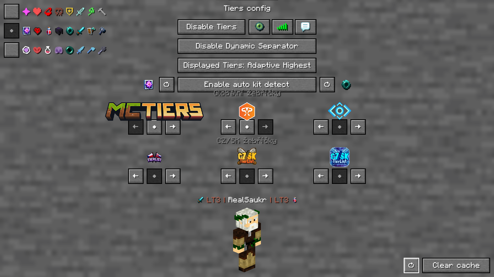
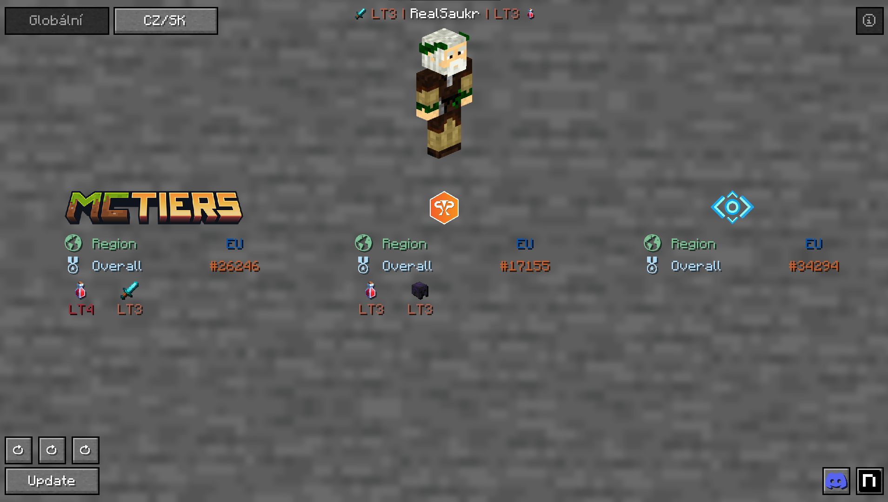
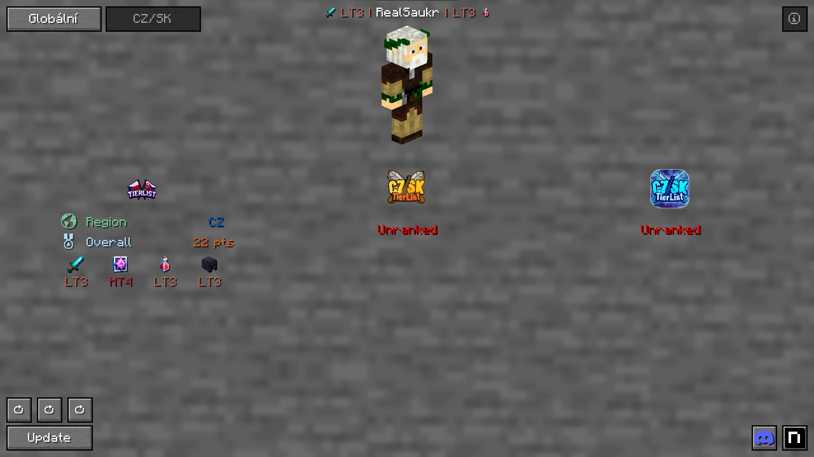



# ⚔️ CZ/SK-MultiTIers 1.0.0

**The ultimate Fabric mod for Minecraft PvP players with native dual-tierlist support.**  
*Seamlessly integrates Global (PvPTiers, MCTiers, Subtiers) and Czechoslovak (CZ/SK) competitive PvP ranking systems.*

 

**Author:** [Saukr](https://github.com/Ahojda231) • **Original Project:** Fork of [PvPTiers/Tiers](https://github.com/PvPTiers/Tiers) by **Flavio6561**

---

## 📸 In-Game Showcase

### 🔍 In-Game Player Profile & Tier Display

 

### ⚙️ Independent Dual Configuration Panels (/tiers -config)

| 🌐 Global Leaderboards Panel | 🇨🇿🇸🇰 CZ/SK Community Leaderboards Panel |
| :---: | :---: |
|  |  |
| *MCTiers, PvPTiers & Subtiers configuration* | *CZSKTiers.com, CZSK (b0tfleyz) & Subtiers configuration* |

---

## ✨ Key Features

- **🏆 6 Supported Leaderboard & Tier Systems:**
  - 🌐 **MCTiers** (mctiers.com)
  - 🌐 **PvPTiers** (pvptiers.com)
  - 🌐 **Subtiers** (subtiers.net)
  - 🇨🇿🇸🇰 **CZSKTiers.com** (Official Czechoslovak ranking via real-time REST API)
  - 🇨🇿🇸🇰 **CZSK Tiers (b0tfleyz)** (Czechoslovak community snapshot)
  - 🇨🇿🇸🇰 **CZSK Subtiers (b0tfleyz)** (Czechoslovak subtiers snapshot)

- **👀 Closest Player Inspection (Key: H):**  
  Instantly displays the 3D skin, overall rank, regional standing, points, and kit badges of the player nearest to you.

- **🎯 Intelligent Auto-Detect Kit (Key: Y):**  
  Scans your current inventory hotbar and automatically determines the active PvP kit (Sword, Axe, Crystal, Pot, UHC, Mace, NethPot, etc.).

- **🔄 Fast Gamemode Switching (Keys: U / I):**  
  Cycle through competitive gamemodes on the fly without ever opening a menu.

- **🎨 Deep In-Game Integration:**
  - Custom Tab list tier badges and colors
  - Chat nametags and rank prefixes
  - Text Display entity badges
  - Dedicated config GUI (/tiers -config or ModMenu)

---

## 📥 Downloads (All 16 Minecraft Versions)

All pre-compiled and verified .jar packages are available in the [jars/](jars/) directory.  
Simply download the JAR for your version and drop it into your .minecraft/mods/ folder!

| Minecraft Version | Java Requirement | Direct Download Link | Size |
| :--- | :---: | :--- | :---: |
| **26.2** | Java 25 | [📦 CZ-SK-MultiTIers-1.0.0+26.2.jar](jars/CZ-SK-MultiTIers-1.0.0+26.2.jar) | 5.19 MB |
| **26.1.2** | Java 25 | [📦 CZ-SK-MultiTIers-1.0.0+26.1.2.jar](jars/CZ-SK-MultiTIers-1.0.0+26.1.2.jar) | 5.19 MB |
| **26.1.1** | Java 25 | [📦 CZ-SK-MultiTIers-1.0.0+26.1.1.jar](jars/CZ-SK-MultiTIers-1.0.0+26.1.1.jar) | 5.19 MB |
| **26.1** | Java 25 | [📦 CZ-SK-MultiTIers-1.0.0+26.1.jar](jars/CZ-SK-MultiTIers-1.0.0+26.1.jar) | 5.19 MB |
| **1.21.11** | Java 21 | [📦 CZ-SK-MultiTIers-1.0.0+1.21.11.jar](jars/CZ-SK-MultiTIers-1.0.0+1.21.11.jar) | 5.19 MB |
| **1.21.10** | Java 21 | [📦 CZ-SK-MultiTIers-1.0.0+1.21.10.jar](jars/CZ-SK-MultiTIers-1.0.0+1.21.10.jar) | 5.19 MB |
| **1.21.9** | Java 21 | [📦 CZ-SK-MultiTIers-1.0.0+1.21.9.jar](jars/CZ-SK-MultiTIers-1.0.0+1.21.9.jar) | 5.19 MB |
| **1.21.8** | Java 21 | [📦 CZ-SK-MultiTIers-1.0.0+1.21.8.jar](jars/CZ-SK-MultiTIers-1.0.0+1.21.8.jar) | 5.19 MB |
| **1.21.7** | Java 21 | [📦 CZ-SK-MultiTIers-1.0.0+1.21.7.jar](jars/CZ-SK-MultiTIers-1.0.0+1.21.7.jar) | 5.19 MB |
| **1.21.6** | Java 21 | [📦 CZ-SK-MultiTIers-1.0.0+1.21.6.jar](jars/CZ-SK-MultiTIers-1.0.0+1.21.6.jar) | 5.19 MB |
| **1.21.5** | Java 21 | [📦 CZ-SK-MultiTIers-1.0.0+1.21.5.jar](jars/CZ-SK-MultiTIers-1.0.0+1.21.5.jar) | 5.19 MB |
| **1.21.4** | Java 21 | [📦 CZ-SK-MultiTIers-1.0.0+1.21.4.jar](jars/CZ-SK-MultiTIers-1.0.0+1.21.4.jar) | 5.19 MB |
| **1.21.3** | Java 21 | [📦 CZ-SK-MultiTIers-1.0.0+1.21.3.jar](jars/CZ-SK-MultiTIers-1.0.0+1.21.3.jar) | 5.19 MB |
| **1.21.2** | Java 21 | [📦 CZ-SK-MultiTIers-1.0.0+1.21.2.jar](jars/CZ-SK-MultiTIers-1.0.0+1.21.2.jar) | 5.19 MB |
| **1.21.1** | Java 21 | [📦 CZ-SK-MultiTIers-1.0.0+1.21.1.jar](jars/CZ-SK-MultiTIers-1.0.0+1.21.1.jar) | 5.19 MB |
| **1.21** | Java 21 | [📦 CZ-SK-MultiTIers-1.0.0+1.21.jar](jars/CZ-SK-MultiTIers-1.0.0+1.21.jar) | 5.19 MB |

---

## 📂 Repository Structure

The repository is organized into distinct directories for source code and compiled binaries:

\\\
CZ-SK-MultiTiers/
├── assets/                    # Screenshots and branding assets used in documentation
│   ├── tiers-ukazka.png
│   ├── tiers-global.png
│   └── tiers-czsk.png
├── jars/                      # Pre-compiled ready-to-use JAR files for all 16 versions
│   ├── CZ-SK-MultiTIers-1.0.0+26.2.jar
│   ├── ...
│   └── CZ-SK-MultiTIers-1.0.0+1.21.jar
├── sources/                   # Complete source trees organized by Minecraft API era
│   ├── 26.2/                  # Source code for Minecraft 26.2 (RenderPipelines, Bed items)
│   ├── 26.1.x/                # Source code for Minecraft 26.1, 26.1.1, 26.1.2
│   ├── 1.21.11/               # Source code for Minecraft 1.21.11 (Identifier API)
│   ├── 1.21.9-1.21.10/        # Source code for Minecraft 1.21.9 & 1.21.10
│   ├── 1.21.6-1.21.8/         # Source code for Minecraft 1.21.6, 1.21.7, 1.21.8
│   ├── 1.21.5/                # Source code for Minecraft 1.21.5
│   ├── 1.21.2-1.21.4/         # Source code for Minecraft 1.21.2, 1.21.3, 1.21.4
│   └── 1.21-1.21.1/           # Source code for Minecraft 1.21 & 1.21.1
├── .gitignore
└── README.md
\\\

---

## 🛠️ Building from Source

To compile the mod from source for any version:

1. Clone the repository:
   \\\ash
   git clone https://github.com/Ahojda231/CZ-SK-MultiTiers.git
   \\\
2. Navigate into your desired version folder, for example sources/1.21.4:
   \\\ash
   cd sources/1.21.4
   \\\
3. Run the Gradle build:
   - **On Linux / macOS:**
     \\\ash
     ./gradlew build
     \\\
   - **On Windows:**
     \\\powershell
     .\gradlew.bat build
     \\\
4. The compiled JAR will be generated in uild/libs/.

---

## 📜 Credits & Attribution

- **Mod Developer:** **Saukr** ([Ahojda231](https://github.com/Ahojda231))
- **Original Mod Creator:** **Flavio6561** ([PvPTiers/Tiers](https://github.com/PvPTiers/Tiers))
- **License:** GNU General Public License v3.0 ([GPL-3.0](LICENSE))
